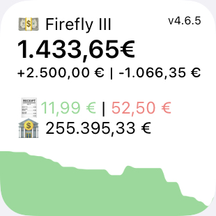

# Firefly III Widget for Scriptable

## Install
- If not already, download Scriptable app from App Store.
- Copy the js file to your iCloud/Scriptable directory.
- Get Firefly Personal Access Token under Options > Profile > OAuth.
- Adapt token and host in the jsfile in the first two lines.

## Features
The widget shows the following things:
- installed firefly version
- balance for the current month
- how much money you have spent and earned this month
- the amount of paid and unpaid invoices
- your net worth
- configure dark/bright theme or use system default (see line 5)

### Planned Features
- Medium sized widget
- Check if you have the newest version of firefly installed